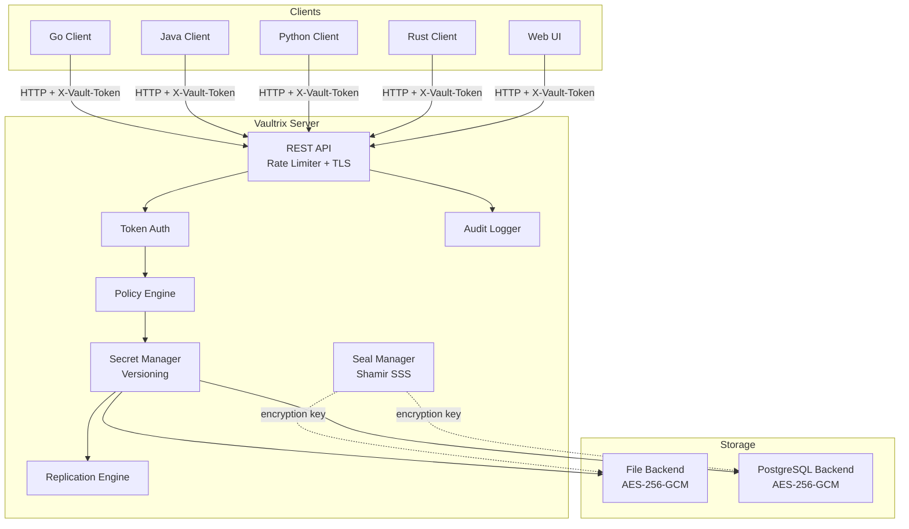
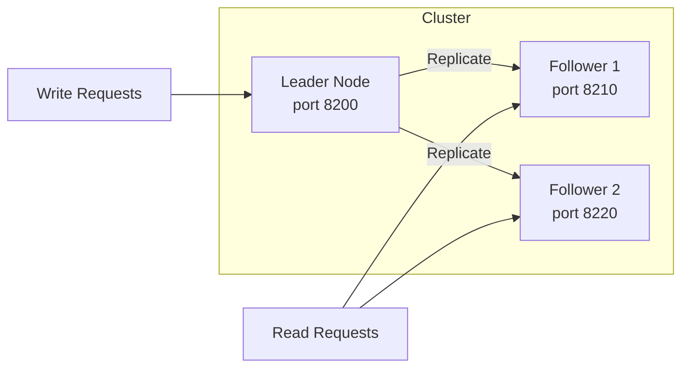
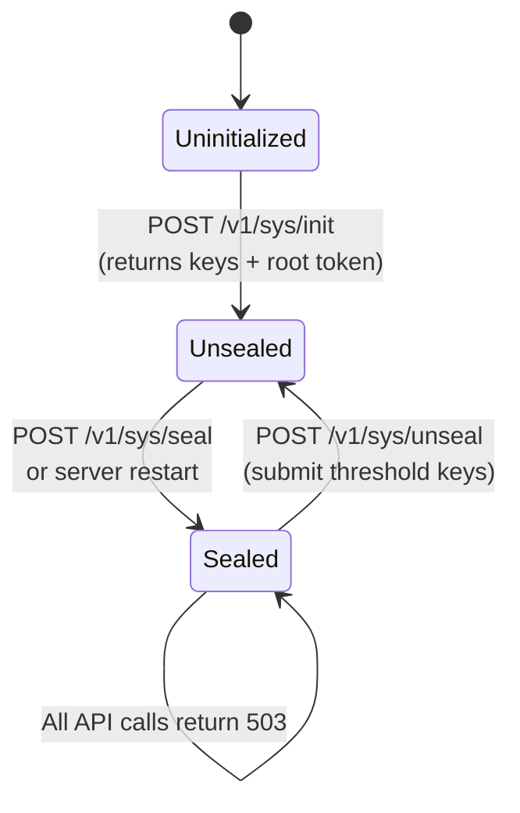
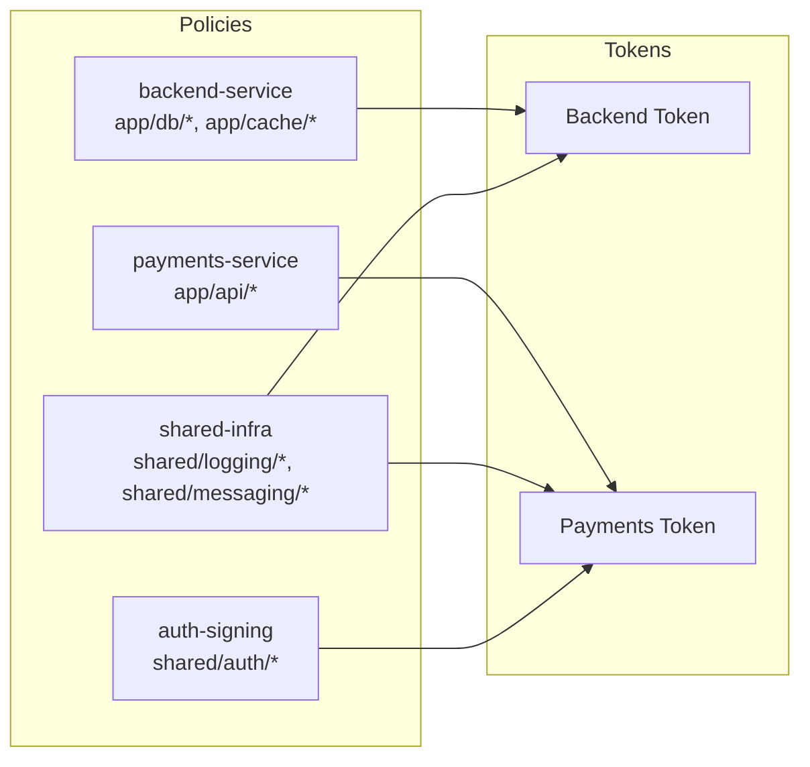
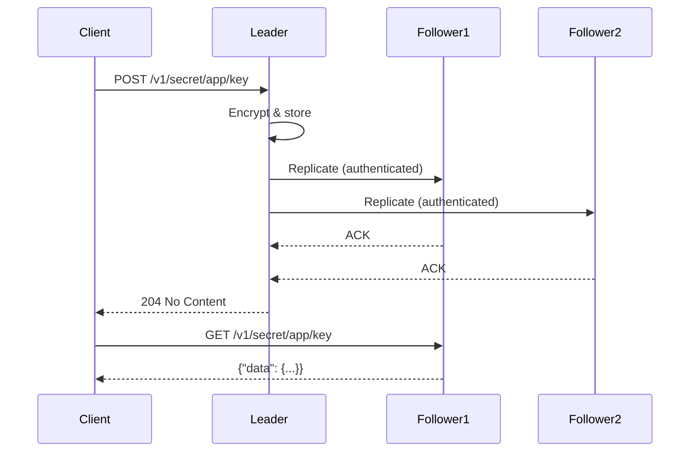

# Vaultrix — Secure Secrets Management

Vaultrix is a secrets management system inspired by HashiCorp Vault. It provides encrypted storage, hierarchical access control, versioned secrets, multi-node replication, and client libraries for Go, Java, Python, and Rust.

## Features

- **Seal/Unseal** — Master key split via Shamir's Secret Sharing; vault starts sealed after every restart
- **Encryption at Rest** — AES-256-GCM for all secrets, metadata, and tokens
- **Policy-Based Access Control** — Path-based rules with `read`, `create`, `update`, `delete`, `list` capabilities
- **Multi-Policy Tokens** — Compose fine-grained policies per service for cross-team secret sharing
- **Secret Versioning** — Every write creates a new version; read any previous version or the latest
- **Audit Logging** — Every operation recorded with timestamp, token, path, and result
- **Leader-Follower Replication** — Write to the leader, read from any node
- **Web UI** — Built-in browser interface at `/ui/` for managing secrets, policies, and tokens
- **Rate Limiting** — Configurable token-bucket rate limiter
- **Client Libraries** — Go, Java, Python, Rust
- **Docker & Kubernetes** — Dockerfile, 3-node compose cluster, and K8s manifests included

## Quick Start

```bash
# Build
go build -o bin/securevault ./cmd/server

# Start
./bin/securevault -config configs/dev-config.yaml &

# Initialize (returns unseal keys + root token)
curl -s -X POST http://127.0.0.1:8200/v1/sys/init \
  -H "Content-Type: application/json" \
  -d '{"secret_shares": 5, "secret_threshold": 3}'

# Store your first secret
curl -s -X POST http://127.0.0.1:8200/v1/secret/app/db/creds \
  -H "X-Vault-Token: $ROOT_TOKEN" \
  -d '{"data": {"username": "admin", "password": "s3cret"}}'

# Read it back
curl -s http://127.0.0.1:8200/v1/secret/app/db/creds \
  -H "X-Vault-Token: $ROOT_TOKEN"

# Open the Web UI
open http://127.0.0.1:8200/ui/
```

> After initialization the vault is unsealed and ready. The unseal keys are needed after a **restart** — see [Seal/Unseal](#sealunseal).

## Architecture





## System Requirements

| Component | Minimum |
|-----------|---------|
| Go | 1.22+ |
| Java (client) | 21+ |
| Rust (client) | 1.70+ |
| Python (client) | 3.9+ |
| Docker (optional) | 20+ |

## Seal/Unseal

Vaultrix uses [Shamir's Secret Sharing](https://en.wikipedia.org/wiki/Shamir%27s_secret_sharing) to protect the master encryption key. On first run, you **initialize** the vault which generates key shares. After any restart, the vault is **sealed** and you must submit enough key shares to unseal it.



```bash
# Initialize (once)
curl -X POST http://127.0.0.1:8200/v1/sys/init \
  -d '{"secret_shares": 5, "secret_threshold": 3}'

# After restart — submit 3 of 5 keys
curl -X POST http://127.0.0.1:8200/v1/sys/unseal -d '{"key": "key-1..."}'
curl -X POST http://127.0.0.1:8200/v1/sys/unseal -d '{"key": "key-2..."}'
curl -X POST http://127.0.0.1:8200/v1/sys/unseal -d '{"key": "key-3..."}'
# → {"sealed": false}
```

## REST API

| Method | Path | Description |
|--------|------|-------------|
| `POST` | `/v1/sys/init` | Initialize vault |
| `POST` | `/v1/sys/unseal` | Submit unseal key |
| `POST` | `/v1/sys/seal` | Seal vault |
| `GET` | `/v1/sys/seal-status` | Seal status |
| `GET` | `/v1/health` | Health check |
| `POST` | `/v1/secret/{path}` | Write secret |
| `GET` | `/v1/secret/{path}` | Read latest version |
| `GET` | `/v1/secret/versions/{v}/{path}` | Read specific version |
| `DELETE` | `/v1/secret/{path}?destroy=true` | Delete secret |
| `GET` | `/v1/secret/list/{path}` | List secrets |
| `GET` | `/v1/secret/metadata/{path}` | Secret metadata |
| `POST` | `/v1/auth/token/create` | Create token |
| `GET` | `/v1/auth/token/lookup-self` | Lookup current token |
| `POST` | `/v1/auth/token/renew-self` | Renew token |
| `POST` | `/v1/auth/token/revoke-self` | Revoke token |
| `POST` | `/v1/policies` | Create policy |
| `GET` | `/v1/policies/{name}` | Get policy |
| `PUT` | `/v1/policies/{name}` | Update policy |
| `DELETE` | `/v1/policies/{name}` | Delete policy |
| `GET` | `/v1/policies` | List policies |
| `GET` | `/v1/audit/events` | Query audit log |

## Client Libraries

### Go

```go
client, _ := securevault.NewClient("http://127.0.0.1:8200", rootToken)

// Write
client.WriteSecret(ctx, "app/db/creds", map[string]interface{}{
    "password": "s3cret",
})

// Read
secret, _ := client.ReadSecret(ctx, "app/db/creds")
fmt.Println(secret.Data["password"])

// Read specific version
v1, _ := client.ReadSecret(ctx, "app/db/creds", securevault.ReadOptions{Version: 1})

// Seal/Unseal
status, _ := client.GetSealStatus(ctx)
client.Unseal(ctx, "unseal-key-hex...")
```

### Java

```java
SecureVaultClient client = SecureVaultClient.builder()
    .address("http://127.0.0.1:8200")
    .token(rootToken)
    .build();

// Write
client.writeSecret("app/db/creds", Map.of("password", "s3cret"));

// Read
Map<String, Object> secret = client.readSecret("app/db/creds");

// Create policy + token
Policy policy = Policy.builder().name("reader").build();
policy.addRule("app/**", List.of("read", "list"));
client.createPolicy(policy);

TokenResponse token = client.createToken(
    TokenCreateOptions.builder()
        .withPolicies(List.of("reader"))
        .withTtl("8h")
        .build());
```

### Python

```python
from securevault import SecureVaultClient

client = SecureVaultClient("http://127.0.0.1:8200", root_token)

client.write_secret("app/db/creds", {"password": "s3cret"})
secret = client.read_secret("app/db/creds")
print(secret.data["password"])
```

### Rust

```rust
use securevault_client::SecureVaultClient;

let client = SecureVaultClient::new("http://127.0.0.1:8200", &root_token);

let mut data = HashMap::new();
data.insert("password".into(), json!("s3cret"));
client.write_secret("app/db/creds", data)?;

let secret = client.read_secret("app/db/creds")?;
println!("{}", secret.data["password"]);
```

## Policies & Cross-Team Sharing

Policies are composable building blocks. A token can have **multiple policies**, and its effective access is the **union** of all of them.



```bash
# Create a shared policy
curl -X POST http://127.0.0.1:8200/v1/policies \
  -H "X-Vault-Token: $ROOT_TOKEN" \
  -d '{"policy": {"name": "shared-infra", "rules": [
    {"path": "shared/logging/*", "capabilities": ["read", "list"]},
    {"path": "shared/messaging/*", "capabilities": ["read", "list"]}
  ]}}'

# Create a token with multiple policies
curl -X POST http://127.0.0.1:8200/v1/auth/token/create \
  -H "X-Vault-Token: $ROOT_TOKEN" \
  -d '{"policy_ids": ["backend-service", "shared-infra"], "ttl": "8h"}'
```

### Path Patterns

| Pattern | Matches |
|---------|---------|
| `app/db/credentials` | Exactly that path |
| `app/db/*` | One level under `app/db/` |
| `app/**` | Everything under `app/` at any depth |
| `*` | Everything (root/admin only) |

## Secret Versioning

Every write to the same path creates a new version. Previous versions are preserved.

```bash
# Write v1
curl -X POST .../v1/secret/app/key -d '{"data": {"val": "one"}}'
# Write v2
curl -X POST .../v1/secret/app/key -d '{"data": {"val": "two"}}'

# Read latest → v2
curl .../v1/secret/app/key
# Read v1
curl .../v1/secret/versions/1/app/key
# Metadata
curl .../v1/secret/metadata/app/key
# → {"current_version": 2, "versions": {"1": {...}, "2": {...}}}
```

## Docker

```bash
# Single node
docker build -t vaultrix .
docker run -p 8200:8200 vaultrix

# 3-node cluster
docker compose -f docker-compose.cluster.yml up --build
```

## Kubernetes

```bash
kubectl apply -f deploy/k8s/namespace.yaml
kubectl apply -f deploy/k8s/configmap.yaml
kubectl apply -f deploy/k8s/leader.yaml
kubectl apply -f deploy/k8s/followers.yaml
```

## Replication



Configure in `config.yaml`:

```yaml
replication:
  mode: "leader"          # or "follower"
  cluster_addr: "10.0.1.10:8201"
  peers:
    - "10.0.1.11:8201"
    - "10.0.1.12:8201"
  shared_secret: "change-me"   # authenticates replication traffic
```

## Testing

```bash
# Unit tests (all packages)
go test ./pkg/... -count=1

# Including 3-node replication test
go test ./pkg/server/ -run TestThreeNodeReplication -v

# Build and run all examples (REST, Go, Python, Java)
bash examples/run-all-examples.sh

# Docker 3-node cluster test
bash deploy/test-cluster.sh
```

## Web UI

The web UI is served at `/ui/` and embedded in the binary — no separate build step.

- Login with any token (root or restricted)
- Browse secrets hierarchically, view/edit key-value pairs
- Create and manage policies and tokens
- View audit log
- Seal/unseal controls

Restricted tokens see an "Access Denied" at root — type the path they have access to (e.g., `app/db`) in the search box.

## Walkthrough

See [`examples/walkthrough/`](examples/walkthrough/README.md) for a complete end-to-end guide covering:

1. **Initial setup** — initialize, unseal, distribute keys
2. **Admin creates secrets & policies** — store secrets, create composable policies, generate multi-policy tokens
3. **Developer uses secrets** — via UI, curl, or client library
4. **Request access to a shared secret** — developer asks admin, admin adds policy to token
5. **Self-service secret management** — team leads create/rotate secrets under their path
6. **After a restart** — key holders unseal the vault

## Project Structure

```
cmd/server/          Server entry point
pkg/
  server/            HTTP handlers, auth, replication
  storage/           File + PostgreSQL backends (encrypted)
  policy/            Policy engine with path matching
  seal/              Shamir's Secret Sharing + seal manager
  audit/             Audit logger
  errors/            Typed error system
  ui/                Embedded web UI
clients/
  go/                Go client library
  java/              Java client (Maven)
  python/            Python client (sync + async)
  rust/              Rust client (reqwest + serde)
examples/
  walkthrough/       End-to-end guide with bash + Java
  go/                Go client example
  python/            Python client example
  rust/              Rust client example
deploy/
  configs/           Docker cluster configs
  k8s/               Kubernetes manifests
  test-cluster.sh    3-node Docker replication test
```

## Security Notes

- Unseal keys and root tokens are shown **once** during initialization — save them securely
- Revoke the root token after initial setup; use policy-scoped tokens for daily operations
- Enable TLS in production (`server.tls.enabled: true`)
- Enable audit logging (`audit.enabled: true`)
- Use short TTLs on tokens and renew programmatically
- Inject tokens via environment variables — never hardcode

## License

MIT
